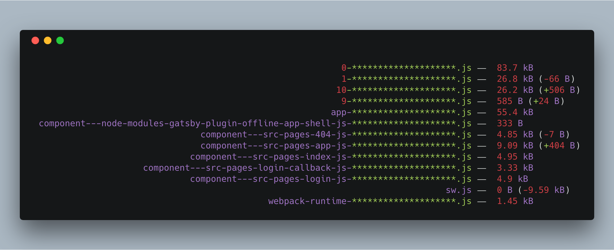

# Gatsby Plugin Webpack Size

<p align="center">
  <a href="https://www.npmjs.com/package/gatsby-plugin-webpack-size">
    
  </a>
  &nbsp;
  <a href="http://npm-stat.com/charts.html?package=gatsby-plugin-webpack-size">
    
  </a>
</p>

> Implements CI friendly bundle size logging for your production builds.



## ☁️ Installation

```sh
npm i gatsby-plugin-webpack-size
```

## 🛫 Setup

Add `'gatsby-plugin-webpack-size'` to the plugins in your `gatsby-config.js` file.

```js
module.exports = {
  plugins: [
    `gatsby-plugin-webpack-size`
  ]
}
```

## ⚙️ Configuration

The only custom option implemented is `development`. All other options are passed to the [size-plugin](https://github.com/GoogleChromeLabs/size-plugin).

```js
module.exports = {
  plugins: [
    [
      `gatsby-plugin-webpack-size`,
      {
        // Set to true to show bundle sizes in development mode as well
        development: true
      }
    ]
  ]
}

```
